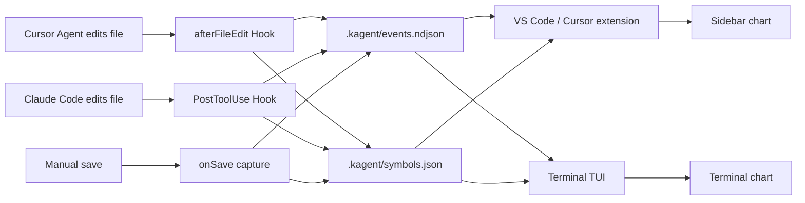

# KAgent

[中文](README.md) · [English](README.en.md)


**Turn every Agent file edit into a stock-style candlestick chart.**

One file = one ticker · First edit = IPO · Each edit round = one candle


> [!NOTE]
> The workspace must be **Trusted** for Cursor Hooks to collect data. Claude Code CLI has no such requirement.

---

## Features

- **Auto-capture**: Cursor `afterFileEdit` hook / Claude Code `PostToolUse` hook / VS Code save capture — three sources writing to the same `.kagent/`
- **Dual visualization**: VS Code / Cursor sidebar webview (`lightweight-charts`) + terminal TUI (zero-dependency Node.js), sharing data in real time
- **Fine-grained candles**: mixed delete/add in one round splits into two candles; same line count with rewritten content is tracked (semantic volatility)
- **CN / US color scheme**: red-up / green-up switchable, with light / dark tone options
- **ST delisted**: manually deleted tracked files are marked delisted, removed from the list after ~30 seconds (history preserved)

---

## Quick Start

### 1. Install the extension (VS Code / Cursor)

Install from [Open VSX](https://open-vsx.org/extension/JStone/kagent):

```bash
codium --install-extension JStone.kagent
# or
code --install-extension JStone.kagent
```

Or download a `.vsix` from [GitHub Releases](https://github.com/JStone2934/KAgent/releases):

```bash
cursor --install-extension kagent-0.1.9.vsix
```

**Reload the window** after install.

<details>
<summary>Package from source</summary>

```powershell
cd extension
npm install
npm run compile
npm run package
```

> **Windows**: if `npm install` fails with `cp` not found, copy the chart bundle manually:
> ```powershell
> Copy-Item -Force node_modules\lightweight-charts\dist\lightweight-charts.standalone.production.js media\lightweight-charts.js
> ```

</details>

### 2. Install hooks

**Cursor**: open the repo root -> `Ctrl+Shift+P` -> `KAgent: 安装项目 Hooks`

```
.cursor/hooks.json
.cursor/hooks/kagent-capture.mjs
.kagent/                 # runtime data; installer adds to .gitignore
```

**Claude Code CLI**: this repo ships with configuration ready to use:

```
.claude/settings.json               # PostToolUse hook config (Edit|Write|MultiEdit)
.claude/hooks/kagent-cc-capture.mjs  # capture script
.claude/hooks/kagent-record.mjs      # shared recorder
```

To use in a new project, copy those three files under `.claude/`.

### 3. View the market

| Entry | Description |
|-------|-------------|
| **KAgent** activity bar icon | VS Code / Cursor sidebar market |
| `KAgent: 打开行情图` | Same view |
| `node scripts/kagent-tui.mjs` | Terminal TUI (no extension needed) |

**VS Code / Cursor sidebar**:

- Left list: each tracked file = one ticker; ▲/▼ trend; 新 / 改 badges for recent IPO or edit
- Right chart: candles + volume; click a row to open the file; pan/zoom preserved
- Top-right: switch CN / US color scheme, light / dark tone

**Terminal TUI**:

```bash
node scripts/kagent-tui.mjs
```

Zero-dependency Node.js. Claude Code edits refresh the chart in real time. State (selected file, color scheme) persists to `.kagent/tui-state.json`.

| Key | Action |
|-----|--------|
| `j` / `k` | Switch file |
| `s` | Toggle CN / US color scheme |
| `r` | Manual refresh |
| `q` | Quit |

---

## Concept

| Real world | KAgent |
|------------|--------|
| A stock | **One file** in the workspace |
| IPO | **First** recorded change to that file |
| One candle | **One round** of edits (OHLC by line count + volume) |
| ST delisted | **Manually deleted** tracked file; grayed out, removed after ~30 seconds |
| Red / green | **Line count** up or down (CN: red up; US: green up — switchable) |

---

## 30-second local demo

No Agent required — simulate edits:

```bash
node scripts/simulate-edit.mjs demo/sample.txt 3
node scripts/simulate-edit.mjs demo/sample.txt 1
```

Open the KAgent sidebar or TUI and select `demo/sample.txt`. Full walkthrough: [demo/watch-me.md](demo/watch-me.md).

---

## Architecture



| Path | Role |
|------|------|
| `.kagent/events.ndjson` | One event per edit (NDJSON) |
| `.kagent/symbols.json` | "Listed" files (incl. delisted state) |
| `.kagent/config.json` | Ignore paths (e.g. `node_modules`) |
| `.kagent/tui-state.json` | TUI state persistence (selected file, color scheme) |

**Candle fields**

| Field | Meaning |
|-------|---------|
| Open / Close | **Line count** at start / end of the candle |
| High / Low | Max / min line count in the round |
| Volume | Lines removed or added |
| Split round | Delete-then-add in one edit → two candles |
| Color | Close ≥ open = bullish; CN red bullish, US green bullish |

---

## FAQ

| Issue | Fix |
|-------|-----|
| Can't find KAgent in Cursor | Cursor doesn't use Open VSX — use [VSIX](#1-install-the-extension-vs-code--cursor) or [Releases](https://github.com/JStone2934/KAgent/releases) |
| Sidebar / TUI always empty | Install hooks or enable save capture, set workspace Trusted, edit/save files (or run the demo script) |
| Hooks never fire | Open the **repo root**; verify `.cursor/hooks.json` or `.claude/settings.json` exists |
| No ST delisted after delete | Use ≥ 0.1.5, Reload Window, click Refresh; only applies to files already in the list |
| `cursor` command not found | Install shell command to PATH from Cursor, restart terminal |

---

## For developers

### Local build

```bash
cd extension
npm install && npm run compile   # dev: npm run watch
npm run package                  # -> kagent-x.y.z.vsix
```

| Asset | Path |
|-------|------|
| UI preview | [docs/images/preview-sidebar.png](docs/images/preview-sidebar.png) |
| Concept art | [docs/images/concept.png](docs/images/concept.png) |
| Demo walkthrough | [demo/watch-me.md](demo/watch-me.md) |

### Release (maintainers)

| Workflow | Purpose |
|----------|---------|
| [CI](.github/workflows/ci.yml) | On `main` / PR changes under `extension/`: compile and package VSIX |
| [Release](.github/workflows/release.yml) | Manual release: bump version -> Open VSX -> push tag -> GitHub Release |

**Ship a version**

1. Actions -> Release -> Run workflow
2. Choose `patch` / `minor` / `major`
3. Toggle Publish to Open VSX
4. Download the VSIX from [Releases](https://github.com/JStone2934/KAgent/releases)

Manual publish (never paste the token on the command line; use an env var):

```powershell
cd extension
$env:OVSX_PAT = "<your-token>"
npm run package
npx ovsx publish kagent-x.y.z.vsix --no-dependencies -p $env:OVSX_PAT
```

---

## License

[MIT](LICENSE)
