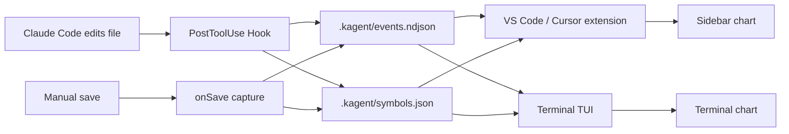

# KAgent

[中文](README.md) · [English](README.en.md)


**Turn every Agent file edit into a stock-style candlestick chart.**

One file = one ticker · First edit = IPO · Each edit round = one candle


> [!NOTE]
> The workspace must be **Trusted** for VS Code save capture to work. Claude Code CLI has no such requirement.

---

## Features

- **Auto-capture**: Claude Code `PostToolUse` hook / VS Code save capture, writing to the same `.kagent/`
- **Dual visualization**: VS Code / Cursor sidebar webview (`lightweight-charts`) + terminal TUI (zero-dependency Node.js), sharing data in real time
- **Fine-grained candles**: mixed delete/add in one round splits into two candles; same line count with rewritten content is tracked (semantic volatility)
- **CN / US color scheme**: red-up / green-up switchable, with light / dark tone options
- **ST delisted**: manually deleted tracked files are marked delisted, removed from the list after ~30 seconds (history preserved)

---

## Quick Start

### Option 1: npx (recommended, no install)

Run directly in your Claude Code working directory:

```bash
npx @enigma_soul/kagent-cc
```

This silently installs Claude Code hooks into the current project. After that, every file edit by Claude Code is automatically captured.

View the K-line chart:

```bash
npx @enigma_soul/kagent-cc tui
```

| Command | Description |
|---------|-------------|
| `npx @enigma_soul/kagent-cc` | Install hooks + launch TUI (default) |
| `npx @enigma_soul/kagent-cc install` | Install hooks only |
| `npx @enigma_soul/kagent-cc tui` | Launch terminal K-line viewer only |
| `npx @enigma_soul/kagent-cc uninstall` | Remove hooks |

Or install globally and use directly:

```bash
npm install -g @enigma_soul/kagent-cc
kagent-cc              # Install hooks + launch TUI
kagent-cc install      # Install hooks only
kagent-cc tui          # Launch TUI only
kagent-cc uninstall    # Remove hooks
```

### Option 2: VS Code / Cursor extension

Install from [Open VSX](https://open-vsx.org/extension/JStone/kagent):

```bash
codium --install-extension JStone.kagent
# or
code --install-extension JStone.kagent
```

Or download a `.vsix` from [GitHub Releases](https://github.com/Enigma-Soul/KAgent-CC/releases):

```bash
cursor --install-extension kagent-0.1.9.vsix
```

**Reload the window** after install. The extension auto-checks and installs Claude Code hooks on startup (silent).

<details>
<summary>Package from source</summary>

```powershell
cd extension
npm install
npm run compile
npm run package
```

> **Windows**: if `npm install` fails with `cp` not found, copy the chart bundle manually:
> ```powershell
> Copy-Item -Force node_modules\lightweight-charts\dist\lightweight-charts.standalone.production.js media\lightweight-charts.js
> ```

</details>

### View the market

| Entry | Description |
|-------|-------------|
| `kagent-cc tui` | Terminal TUI (no extension needed) |
| **KAgent** activity bar icon | VS Code / Cursor sidebar market |
| `KAgent: 打开行情图` | Same view |

**Terminal TUI**:

```
kagent-cc tui
```

Zero-dependency Node.js. Claude Code edits refresh the chart in real time. State (selected file, color scheme) persists to `.kagent/tui-state.json`.

| Key | Action |
|-----|--------|
| `j` / `k` | Switch file |
| `s` | Toggle CN / US color scheme |
| `r` | Manual refresh |
| `q` | Quit |

**VS Code / Cursor sidebar**:

- Left list: each tracked file = one ticker; ▲/▼ trend; 新 / 改 badges for recent IPO or edit
- Right chart: candles + volume; click a row to open the file; pan/zoom preserved
- Top-right: switch CN / US color scheme, light / dark tone

---

## Concept

| Real world | KAgent |
|------------|--------|
| A stock | **One file** in the workspace |
| IPO | **First** recorded change to that file |
| One candle | **One round** of edits (OHLC by line count + volume) |
| ST delisted | **Manually deleted** tracked file; grayed out, removed after ~30 seconds |
| Red / green | **Line count** up or down (CN: red up; US: green up - switchable) |

---

## Architecture



| Path | Role |
|------|------|
| `.kagent/events.ndjson` | One event per edit (NDJSON) |
| `.kagent/symbols.json` | "Listed" files (incl. delisted state) |
| `.kagent/config.json` | Ignore paths (e.g. `node_modules`) |
| `.kagent/tui-state.json` | TUI state persistence (selected file, color scheme) |

**Candle fields**

| Field | Meaning |
|-------|---------|
| Open / Close | **Line count** at start / end of the candle |
| High / Low | Max / min line count in the round |
| Volume | Lines removed or added |
| Split round | Delete-then-add in one edit -> two candles |
| Color | Close ≥ open = bullish; CN red bullish, US green bullish |

---

## FAQ

| Issue | Fix |
|-------|-----|
| Sidebar / TUI always empty | Install hooks or enable save capture, set workspace Trusted, edit/save files |
| Hooks never fire | Open the **repo root**; verify `.claude/settings.json` exists |
| No ST delisted after delete | Use ≥ 0.1.5, Reload Window, click Refresh; only applies to files already in the list |
| Can't find KAgent in Cursor | Cursor doesn't use Open VSX - use [VSIX](#option-2-vs-code--cursor-extension) or [Releases](https://github.com/Enigma-Soul/KAgent-CC/releases) |

---

## For developers

### Local build

```bash
# npm package (requires Bun)
bun build src/capture.mjs --outfile dist/capture.mjs
bun build src/tui.mjs --outfile dist/tui.mjs

# VS Code extension
cd extension
npm install && npm run compile   # dev: npm run watch
npm run package                  # -> kagent-x.y.z.vsix
```

| Asset | Path |
|-------|------|
| UI preview | [docs/images/preview-sidebar.png](docs/images/preview-sidebar.png) |
| Concept art | [docs/images/concept.png](docs/images/concept.png) |

### Release (maintainers)

| Workflow | Purpose |
|----------|---------|
| [CI](.github/workflows/ci.yml) | On push/PR: Bun bundle + compile extension + package VSIX |
| [Release](.github/workflows/release.yml) | On tag `v*`: npm publish + Open VSX + GitHub Release |

**Ship a version**

1. `git tag v0.1.0 && git push --tags` triggers auto-release
2. CI auto: Bun bundle -> npm publish -> extension compile -> Open VSX publish -> GitHub Release
3. Download VSIX from [Releases](https://github.com/Enigma-Soul/KAgent-CC/releases)

> Requires GitHub Secrets: `NPM_TOKEN` (npm access token), `OVSX_PAT` (Open VSX token)

---

## License

[MIT](LICENSE)
