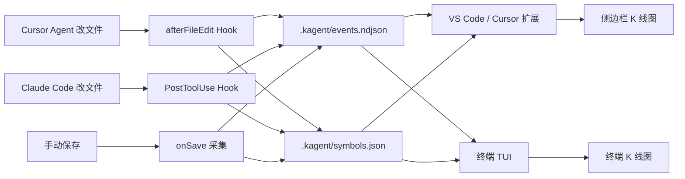

# KAgent

[中文](README.md) · [English](README.en.md)


**把 Agent 的每次改文件，画成一支「股票」的 K 线。**

一个文件 = 一支股票 · 首次被改 = 上市 · 每次编辑 = 一根 K 线


> [!NOTE]
> 工作区须为 **Trusted**，Cursor Hooks 才会采集数据。Claude Code CLI 无此限制。

---

## 特性

- **自动采集**：Cursor `afterFileEdit` Hook / Claude Code `PostToolUse` Hook / VS Code 保存采集，三路并行写入同一份 `.kagent/`
- **双端可视化**：VS Code / Cursor 侧边栏 webview（`lightweight-charts`）+ 终端 TUI（零依赖纯 Node.js），共享数据实时同步
- **细粒度 K 线**：同轮既有删又有增拆成两根；行数不变但内容被改写也记入（语义波动）
- **A 股 / 美股**：红涨绿跌 / 绿涨红跌可切换，亮色 / 暗色色调可选
- **ST 退市**：手动删除已跟踪文件后标记退市，约 30 秒后从列表移除（历史保留）

---

## 快速开始

### 1. 安装扩展（VS Code / Cursor）

从 [Open VSX](https://open-vsx.org/extension/JStone/kagent) 安装：

```bash
codium --install-extension JStone.kagent
# 或
code --install-extension JStone.kagent
```

或从 [GitHub Releases](https://github.com/JStone2934/KAgent/releases) 下载 `.vsix`：

```bash
cursor --install-extension kagent-0.1.9.vsix
```

安装后 **重新加载窗口**。

<details>
<summary>从源码打包</summary>

```powershell
cd extension
npm install
npm run compile
npm run package
```

> **Windows**：`npm install` 报 `cp` 不存在时，手动复制图表库：
> ```powershell
> Copy-Item -Force node_modules\lightweight-charts\dist\lightweight-charts.standalone.production.js media\lightweight-charts.js
> ```

</details>

### 2. 安装 Hooks

**Cursor**：打开仓库根目录 → `Ctrl+Shift+P` → `KAgent: 安装项目 Hooks`

```
.cursor/hooks.json
.cursor/hooks/kagent-capture.mjs
.kagent/                 # 运行时数据；安装时会写入 .gitignore
```

**Claude Code CLI**：本仓库已自带配置，克隆即用：

```
.claude/settings.json               # PostToolUse Hook 配置（Edit|Write|MultiEdit）
.claude/hooks/kagent-cc-capture.mjs  # 采集脚本
.claude/hooks/kagent-record.mjs      # 共享记录器
```

在新项目中使用时，将 `.claude/` 下三个文件复制过去即可。

### 3. 看行情

| 入口 | 说明 |
|------|------|
| 活动栏 **KAgent** 图标 | VS Code / Cursor 侧边栏行情 |
| `KAgent: 打开行情图` | 同上 |
| `node scripts/kagent-tui.mjs` | 终端 TUI（无需扩展） |

**VS Code / Cursor 侧边栏**：

- 左侧列表：每个被跟踪文件 = 一支股票；▲/▼ 涨跌；新 / 改 标记
- 右侧图表：K 线 + 成交量；点击列表项打开文件；拖动缩放后保留视图
- 右上角：切换 A 股 / 美股、亮 / 暗

**终端 TUI**：

```bash
node scripts/kagent-tui.mjs
```

零依赖纯 Node.js，Claude Code 每编辑一个文件实时刷新 K 线。状态（选中文件、配色）持久化到 `.kagent/tui-state.json`。

| 按键 | 功能 |
|-----|------|
| `j` / `k` | 切换文件 |
| `s` | 切换 A 股 / 美股配色 |
| `r` | 手动刷新 |
| `q` | 退出 |

---

## 概念

| 现实世界 | KAgent |
|---------|--------|
| 一支股票 | 工作区里的 **一个文件** |
| 上市 | **第一次**被记录到该文件 |
| 一根 K 线 | **一轮**编辑（行数开高低收 + 成交量） |
| ST 退市 | **手动删除**已跟踪文件；灰色显示，约 30 秒后下市 |
| 红 / 绿 | **行数**变多或变少（A 股红涨绿跌 / 美股相反，可切换） |

---

## 30 秒本地演示

无需启动 Agent，用脚本模拟编辑：

```bash
node scripts/simulate-edit.mjs demo/sample.txt 3
node scripts/simulate-edit.mjs demo/sample.txt 1
```

打开 KAgent 侧边栏或 TUI，选中 `demo/sample.txt`。完整剧本见 [demo/watch-me.md](demo/watch-me.md)。

---

## 架构



| 路径 | 作用 |
|------|------|
| `.kagent/events.ndjson` | 每次编辑一条事件（NDJSON） |
| `.kagent/symbols.json` | 已「上市」文件列表（含退市状态） |
| `.kagent/config.json` | 忽略路径（默认排除 `node_modules` 等） |
| `.kagent/tui-state.json` | TUI 状态持久化（选中文件、配色） |

**K 线字段**

| 字段 | 含义 |
|------|------|
| Open / Close | 该根 K 线起止 **行数** |
| High / Low | 该阶段最高 / 最低行数 |
| Volume | 删除或增加的行数 |
| 同轮拆分 | 同一次修改既有删又有增：先「删」K 线，再「增」K 线 |
| 颜色 | 收 ≥ 开为阳；A 股红阳绿阴，美股绿阳红阴 |

---

## 常见问题

| 现象 | 处理 |
|------|------|
| Cursor 里搜不到 KAgent | Cursor 不走 Open VSX，用 [VSIX](#1-安装扩展vs-code--cursor) 或 [Releases](https://github.com/JStone2934/KAgent/releases) |
| 侧边栏 / TUI 一直是空的 | 确认已安装 Hooks 或开启保存采集、工作区 Trusted、改过/保存过文件（或跑模拟脚本） |
| Hooks 不触发 | 必须打开仓库根目录；检查 `.cursor/hooks.json` 或 `.claude/settings.json` 是否存在 |
| 删文件后没有 ST 退市 | 安装 ≥ 0.1.5 并 Reload Window；点刷新行情；仅对已出现在列表中的文件生效 |
| `cursor` 命令找不到 | 在 Cursor 中安装 Shell 命令到 PATH，重启终端 |

---

## 开发者

### 本地构建

```bash
cd extension
npm install && npm run compile   # 日常开发：npm run watch
npm run package                  # 产出 kagent-x.y.z.vsix
```

| 资源 | 路径 |
|------|------|
| 界面示意 | [docs/images/preview-sidebar.png](docs/images/preview-sidebar.png) |
| 概念示意 | [docs/images/concept.png](docs/images/concept.png) |
| 演示说明 | [demo/watch-me.md](demo/watch-me.md) |

### 发布 Release（维护者）

| Workflow | 作用 |
|----------|------|
| [CI](.github/workflows/ci.yml) | `main` / PR 变更 `extension/` 时自动编译并打包 VSIX |
| [Release](.github/workflows/release.yml) | 手动发版：递增版本 → Open VSX → 推送 tag → GitHub Release |

**发版步骤**

1. Actions → Release → Run workflow
2. 选择 `patch` / `minor` / `major`
3. 勾选 Publish to Open VSX
4. 完成后在 [Releases](https://github.com/JStone2934/KAgent/releases) 下载 VSIX

本地手动发布（勿在命令行明文粘贴 token）：

```powershell
cd extension
$env:OVSX_PAT = "<your-token>"
npm run package
npx ovsx publish kagent-x.y.z.vsix --no-dependencies -p $env:OVSX_PAT
```

---

## License

[MIT](LICENSE)
